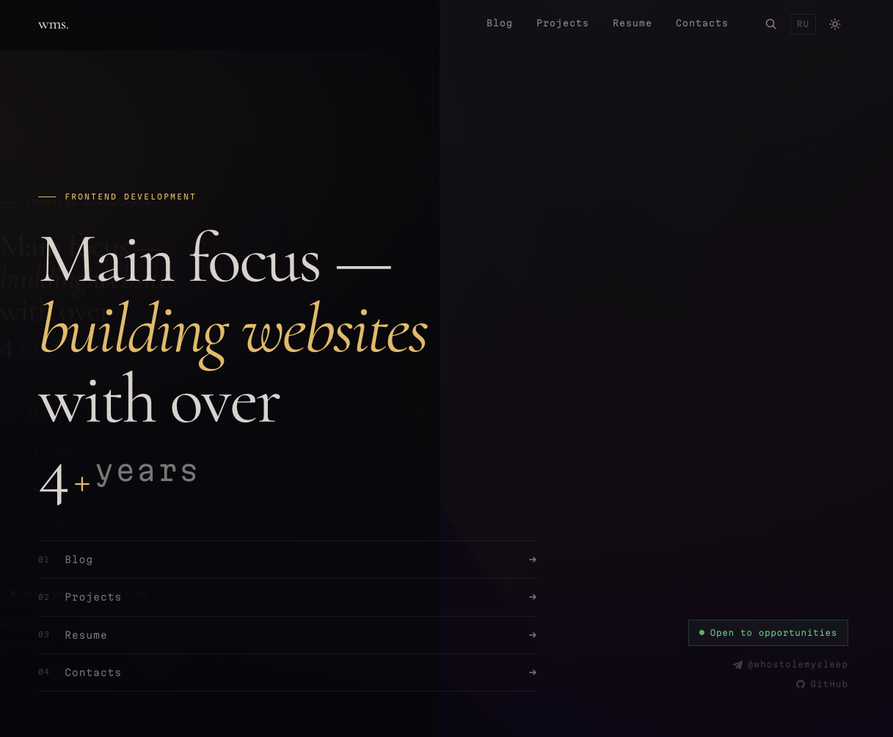

# whostolemysleep.ru

Personal portfolio site with a built-in CMS. Blog, projects, resume — all managed through an admin panel, stored in a real database, deployed on Vercel with ISR.

> Built for personal use and as a technical showcase. The stack is deliberately full — serverless DB, blob storage, JWT auth, ISR, i18n — because it is itself a project in the portfolio.

<p align="center">
  
</p>

## Features

- Bilingual — EN / RU, auto-detected from URL prefix (`/en/*`, `/ru/*`)
- Blog and projects as a single `post` entity — two types, one editor
- Resume section — experience, education, skills — all editable via admin
- Full-text search via Fuse.js (client-side, no external index)
- Contact form — manual validation, honeypot spam trap, rate limiting (3 req/hour/IP)
- Light / Dark theme — persisted in `localStorage`, applied before render (no flash)
- ISR caching for public routes, SSR for contacts and admin
- Custom 404 / 500 error pages — outline digit with neon burnout animation
- Self-hosted fonts — Cormorant Garamond + Martian Mono
- Vercel Analytics + Speed Insights wired in

## Stack

| Layer | Library | Version |
|---|---|---|
| Framework | Nuxt | 4.4.6 |
| Language | TypeScript | 6 |
| ORM | Drizzle ORM | 0.45 |
| Database | Neon (PostgreSQL serverless) | — |
| Image storage | Vercel Blob | 2.4 |
| Auth | jose (JWT) + bcryptjs | — |
| i18n | @nuxtjs/i18n | 10.4 |
| State | Pinia | 3 |
| Search | Fuse.js | 7 |
| Mailer | nodemailer | 8 |
| Styles | SCSS + CSS variables | — |

## Setup

```bash
git clone https://github.com/WhoStoleMySleepDev/whostolemysleep-ru
cd whostolemysleep-ru
pnpm install

cp .env.example .env
# fill in .env — see section below

pnpm db:migrate                    # apply schema migrations
node scripts/create-settings.mjs  # seed settings table (run once)
```

### Create admin user

There is no registration UI. Insert a user directly:

```sql
INSERT INTO "user" (email, password_hash, role)
VALUES ('you@example.com', '<bcrypt_hash>', 'admin');
```

Generate a bcrypt hash (Node.js):

```js
import bcrypt from 'bcryptjs'
console.log(await bcrypt.hash('your_password', 12))
```

Then log in at `/admin/login`.

### Seed demo content (optional)

```bash
npx tsx server/db/seed.ts
```

Inserts sample blog posts, projects, skills, and work experience.

## Environment

```
POSTGRES_PRISMA_URL=        # Neon pooled connection (for app)
POSTGRES_URL_NON_POOLING=   # Neon direct connection (for migrations)
EMAIL=                      # Gmail address used to send contact form messages
EMAIL_PASSWORD=             # Gmail App Password — not the account password
NUXT_PUBLIC_SITE_URL=       # https://whostolemysleep.ru
```

> Gmail App Password: Google Account → Security → 2-Step Verification → App passwords

## Commands

| Command | What it does |
|---|---|
| `pnpm dev` | Dev server with Nuxt devtools |
| `pnpm build` | Production build |
| `pnpm preview` | Preview production build locally |
| `pnpm db:generate` | Generate Drizzle migration from schema changes |
| `pnpm db:migrate` | Apply pending migrations |
| `pnpm db:studio` | Open Drizzle Studio (visual DB browser) |
| `pnpm db:introspect` | Reverse-engineer schema from existing DB |

## Structure

```
app/
  pages/
    index.vue           # Home — hero, about, latest posts
    blog/               # Blog list + post page
    projects/           # Projects list
    resume/             # Resume — experience, education, skills
    contacts/           # Contact form
    admin/              # CMS — posts, resume sections, settings
  components/           # UI components (UiButton, PostCard, etc.)
  composables/          # Shared logic (useSettings, useLocale, etc.)
  assets/css/           # Design tokens, global styles, fonts
  error.vue             # Custom 404 / 500 error page

server/
  api/
    blog/               # Public blog endpoints
    posts/              # Public posts by type (blog / project)
    resume/             # Public experience + education endpoints
    admin/              # Protected CMS endpoints (JWT-guarded)
    contact.post.ts     # Contact form — rate limit + honeypot + email
  db/
    schema.ts           # Drizzle schema (all tables)
    migrations/         # SQL migration files
    seed.ts             # Demo data seed script
  middleware/           # Auth check for /api/admin/* routes
  utils/                # checkRateLimit, auth helpers

i18n/
  locales/
    en.json             # English strings
    ru.json             # Russian strings

public/
  fonts/                # Self-hosted woff2 (Cormorant + Martian Mono)
```

## Admin panel

Route `/admin` is JWT-protected (httpOnly cookie, 7-day expiry).

Manages:

- **Posts** — create / edit blog posts and project entries, bilingual (RU + EN), with Vercel Blob image upload
- **About** — "About me" section text
- **Experience** — companies, positions, bullet points
- **Education** — institutions and dates
- **Skills** — grouped skill lists
- **Settings** — open-to-work toggle, social links, contact email

After editing content, hit "Revalidate" in the admin settings to purge ISR cache on Vercel.

## Deployment

Deployed on Vercel. Neon and Vercel Blob are both provisioned through the Vercel marketplace — environment variables are set automatically.

ISR revalidation windows:

| Route | Window |
|---|---|
| Home (`/ru`, `/en`) | 1 hour |
| Blog, Projects | 10 min |
| Resume | 2 hours |
| Contacts, Admin | Always SSR |

## License

MIT
