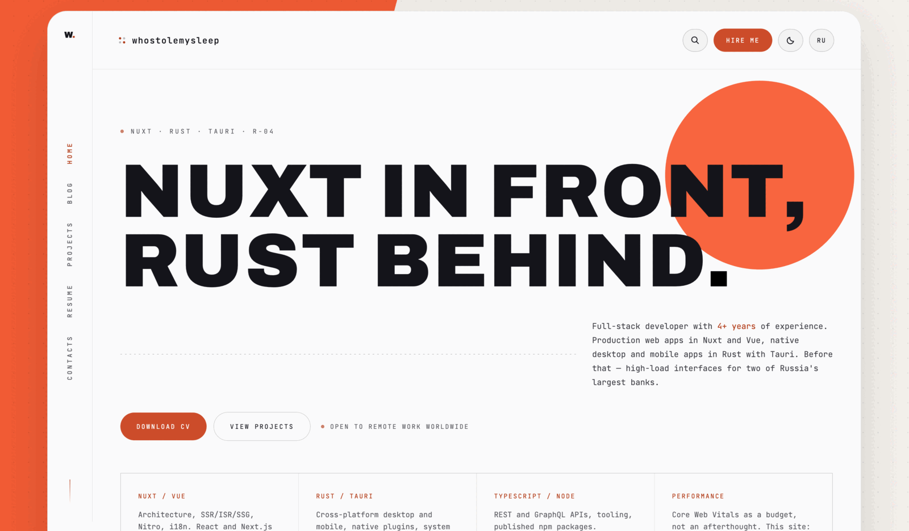

# whostolemysleep.ru

Personal portfolio site with a built-in CMS. Blog, projects, resume — all managed through an admin panel, stored in a real database, deployed on Vercel with ISR.

> Built for personal use and as a technical showcase. The stack is deliberately full — serverless DB, blob storage, JWT auth, ISR, i18n — because it is itself a project in the portfolio.

<p align="center">
  
</p>

## Features

- Bilingual — EN / RU, auto-detected from URL prefix (`/en/*`, `/ru/*`)
- Blog and projects as a single `post` entity — two types, one editor
- Resume section — experience, education, skills — all editable via admin
- Full-text search via Fuse.js (client-side, no external index)
- Contact form — manual validation, honeypot spam trap, rate limiting (3 req/hour/IP)
- Light / Dark theme — persisted in `localStorage`, applied before render (no flash)
- ISR caching for public routes, SSR for contacts and admin
- Custom 404 / 500 error pages — outline digit with neon burnout animation
- Self-hosted fonts — Cormorant Garamond + Martian Mono
- Vercel Analytics + Speed Insights wired in

## Stack

| Layer | Library | Version |
|---|---|---|
| Framework | Nuxt | 4.4.6 |
| Language | TypeScript | 6 |
| ORM | Drizzle ORM | 0.45 |
| Database | Neon (PostgreSQL serverless) | — |
| Image storage | Vercel Blob | 2.4 |
| Auth | jose (JWT) + bcryptjs | — |
| i18n | @nuxtjs/i18n | 10.4 |
| State | Pinia | 3 |
| Search | Fuse.js | 7 |
| Mailer | nodemailer | 8 |
| Styles | SCSS + CSS variables | — |

## Setup

```bash
git clone https://github.com/WhoStoleMySleepDev/whostolemysleep-ru
cd whostolemysleep-ru
pnpm install

cp .env.example .env
# fill in .env — see section below

pnpm db:migrate                    # apply schema migrations
node scripts/create-settings.mjs  # seed settings table (run once)
```

### Admin credentials

There is no registration — the admin is one password, stored as a bcrypt hash in the environment, and a secret for signing the session cookie:

```bash
node scripts/admin-secrets.mjs
```

It asks for a password (hidden input, so it stays out of the shell history) and prints `ADMIN_JWT_SECRET` and `ADMIN_PASSWORD_HASH` to paste into `.env` and into the Vercel project. Changing `ADMIN_JWT_SECRET` logs out every open session.

Then log in at `/admin/login`.

### Seed demo content (optional)

```bash
npx tsx server/db/seed.ts
```

Inserts sample blog posts, projects, skills, and work experience.

## Environment

```
POSTGRES_PRISMA_URL=        # Neon pooled connection (for app)
POSTGRES_URL_NON_POOLING=   # Neon direct connection (for migrations)
EMAIL=                      # Gmail address used to send contact form messages
EMAIL_PASSWORD=             # Gmail App Password — not the account password
ADMIN_JWT_SECRET=           # signs the admin session cookie
ADMIN_PASSWORD_HASH=        # bcrypt hash of the admin password
ISR_BYPASS_TOKEN=           # 32 hex chars; lets the admin purge Vercel's ISR cache
NUXT_PUBLIC_SITE_URL=       # https://whostolemysleep.ru
PUBLISH_TOKEN=              # bearer token for the external publisher — leave unset to disable
NEON_LOCAL_SQL_ENDPOINT=    # local dev only: HTTP proxy in front of a plain Postgres
```

> Gmail App Password: Google Account → Security → 2-Step Verification → App passwords

## Commands

| Command | What it does |
|---|---|
| `pnpm dev` | Dev server with Nuxt devtools |
| `pnpm build` | Production build |
| `pnpm preview` | Preview production build locally |
| `pnpm test` | Run the test suite once |
| `pnpm test:watch` | Re-run affected tests on change |
| `pnpm test:coverage` | Test run with a coverage report |
| `pnpm lint` | ESLint over the whole repo (warnings fail too) |
| `pnpm lint:fix` | Same, applying the fixes it can |
| `pnpm typecheck` | `vue-tsc` over the project |
| `pnpm db:generate` | Generate Drizzle migration from schema changes |
| `pnpm db:migrate` | Apply pending migrations |
| `pnpm db:studio` | Open Drizzle Studio (visual DB browser) |
| `pnpm db:introspect` | Reverse-engineer schema from existing DB |

## Tests and checks

Vitest runs inside a real Nuxt environment (`@nuxt/test-utils`), so specs get the same auto-imports and aliases as the app. Files mirror the code they cover: `server/utils/cv.ts` → `tests/nuxt/server/utils/cv.spec.ts`.

```
tests/nuxt/
  components/   # rendering and props — mountSuspended
  composables/  # app-side logic
  server/utils/ # pure helpers, auth, cache invalidation
```

Covered first are the places where a silent mistake is expensive: CV import parsing and diffing, ISR cache invalidation, admin session sliding, the publisher's token check, and HTML sanitising.

Git hooks (husky):

| Hook | What runs |
|---|---|
| `pre-commit` | `lint-staged` — ESLint on staged files plus the tests related to them |
| `pre-push` | the whole suite |

CI (`.github/workflows/ci.yml`) repeats lint, tests and build on every branch and pull request.

ESLint deliberately carries no formatting rules — values across this codebase are aligned into columns by hand, and an autoformatter would flatten them.

## Structure

```
app/
  pages/
    index.vue           # Home — hero, about, latest posts
    blog/               # Blog list + post page
    projects/           # Projects list
    resume/             # Resume — experience, education, skills
    contacts/           # Contact form
    admin/              # CMS — posts, resume sections, settings
  components/           # UI components (UiButton, PostCard, etc.)
  composables/          # Shared logic (useSettings, useLocale, etc.)
  assets/css/           # Design tokens, global styles, fonts
  error.vue             # Custom 404 / 500 error page

server/
  api/
    blog/               # Public blog endpoints
    posts/              # Public posts by type (blog / project)
    resume/             # Public experience + education endpoints
    admin/              # Protected CMS endpoints (JWT-guarded)
    contact.post.ts     # Contact form — rate limit + honeypot + email
  db/
    schema.ts           # Drizzle schema (all tables)
    migrations/         # SQL migration files
    seed.ts             # Demo data seed script
  middleware/           # Auth check for /api/admin/* routes
  utils/                # checkRateLimit, auth helpers

i18n/
  locales/
    en.json             # English strings
    ru.json             # Russian strings

public/
  fonts/                # Self-hosted woff2 (Cormorant + Martian Mono)
```

## Admin panel

Route `/admin` is JWT-protected (httpOnly cookie, `SameSite=lax`, 7-day expiry, slid forward while the panel is in use). Failed logins are counted per client address — five in fifteen minutes and the address waits.

Manages:

- **Posts** — create / edit blog posts and project entries, bilingual (RU + EN), with Vercel Blob image upload
- **About** — "About me" section text
- **Experience** — companies, positions, bullet points
- **Education** — institutions and dates
- **Skills** — grouped skill lists
- **Settings** — open-to-work toggle, social links, contact email

After editing content, hit "Revalidate" in the admin settings to purge the ISR cache on Vercel. It works by requesting each queued page with the `x-prerender-revalidate` header, so `ISR_BYPASS_TOKEN` has to be set both at build time (it is baked into the generated prerender config) and at runtime.

Uploads accept png, jpeg, gif and webp only, up to 8 MB, and the type is decided by the file's own signature — the browser's `Content-Type` and the file extension are attacker-controlled, and a file stored as `text/html` on a public bucket becomes a page.

## Security notes

Nothing exotic, but worth knowing where the edges are:

- **Rate limits live in Postgres, not in process memory.** Serverless instances are many and short-lived, so an in-memory counter is a counter that resets whenever the platform feels like it.
- **`x-forwarded-for` is not trusted.** Anyone can send that header, and keying a limiter by it means the limiter can be walked around by changing a string. The address comes from Vercel's own header, falling back to the socket address.
- **All stored HTML goes through `sanitize-html`** — text typed in the admin panel and Markdown rendered from the publisher alike.
- **Content-Security-Policy and friends** are set for every route in `routeRules`. The policy allows inline styles and scripts because Nuxt needs them for hydration; everything else is limited to this origin, Vercel's telemetry and the Blob domain that serves post images.
- **Drafts stay drafts** — public endpoints filter on `is_published`, so an unpublished post is not reachable by guessing its slug.

## Publishing API

An external publisher — [NuxtPublish](https://github.com/WhoStoleMySleepDev), which runs on a home server behind Tailscale — pushes finished posts here instead of me pasting them into the admin panel. Three endpoints, all under `/api/publish`, authorised by a bearer token from `PUBLISH_TOKEN`:

| Endpoint | What it does |
|---|---|
| `GET /health` | connectivity check; no token required, and it reveals nothing beyond whether publishing is configured |
| `POST /posts` | creates or updates a post; repeating the same `external_id` updates it instead of adding a duplicate |
| `PUT /posts/{id}` | updates a specific post |

The payload is Markdown-first, because that is what the publisher stores:

```jsonc
{
  "external_id": "uuid of the post in the publisher",
  "slug": "kak-ya-pisal-bekend-na-rust",
  "title": "Как я писал бэкенд на Rust",
  "lead": "Short excerpt",
  "body_md": "# Heading\n\nText…",
  "cover_url": "https://…/cover.webp",
  "tags": ["Rust", "backend"],
  "status": "published",
  "section": "blog"
}
```

What happens on the way in:

- **Markdown becomes HTML** and goes through the same sanitizer as anything typed in the admin panel — the publisher is trusted with a token, not with raw markup.
- **English fields stay empty.** Reading falls back to Russian when the English column is blank, so a post shows up immediately and can be translated later from the admin panel.
- **Tags arrive as names, not ids** — missing ones are created, slugs transliterated (`Заметки` → `zametki`).
- **A slug that belongs to someone else is a 409**, not a silent overwrite. Posts written in the admin panel have no `external_id`, so the publisher may adopt one by slug; a post that already belongs to a different `external_id` is left alone.
- **ISR paths are queued** exactly as the admin panel does it, so the new post appears without a manual revalidate.

## API reference

Every handler under `server/api` and `server/routes` carries a `defineRouteMeta({ openAPI: … })` block, so the specification is generated from the routes themselves and cannot drift away from them — a renamed field is a diff in the same file as the code.

Nitro serves it in dev only:

| URL | What it is |
|---|---|
| `/_openapi.json` | the specification itself, OpenAPI 3.1 |
| `/_docs/scalar` | Scalar UI — grouped by tag, with a request runner |
| `/_docs/swagger` | Swagger UI, for whoever prefers it |

`openAPI.production` is `false` in `nuxt.config.ts`: the spec is a development aid, and the deployed site has no reason to hand out a map of its admin endpoints. Flip it to `'prerender'` if a published reference is ever needed.

Operations are tagged by area — `Публичные`, `Публикатор`, `Админка: посты / резюме / навыки / настройки / кеш / сессия / дашборд`, `Служебные`. Shared pieces (error shapes, the `locale` query parameter, both security schemes) live in the `$global` block of `server/api/settings.get.ts`; domain schemas sit in the route that first returns them and are reused through `$ref`.

Two security schemes are described: `adminCookie` (the `wms_admin` JWT cookie, issued by `POST /api/admin/login`) and `publishToken` (the bearer token from `PUBLISH_TOKEN`). Everything under `/api/admin` except login is behind the cookie — `server/middleware/admin-guard.ts` enforces it before any handler runs.

## Deployment

Deployed on Vercel. Neon and Vercel Blob are both provisioned through the Vercel marketplace — environment variables are set automatically.

`PUBLISH_TOKEN` is the exception: generate it (`openssl rand -base64 32`), add it to the Vercel project, and paste the same value into the publisher's site target. Without it `/api/publish` answers 503 and nothing can be posted.

ISR revalidation windows:

| Route | Window |
|---|---|
| Home (`/ru`, `/en`) | 1 hour |
| Blog, Projects | 10 min |
| Resume, CV, Contacts | 2 hours |
| Privacy | 24 hours |
| Admin | Always SSR |

## License

MIT
